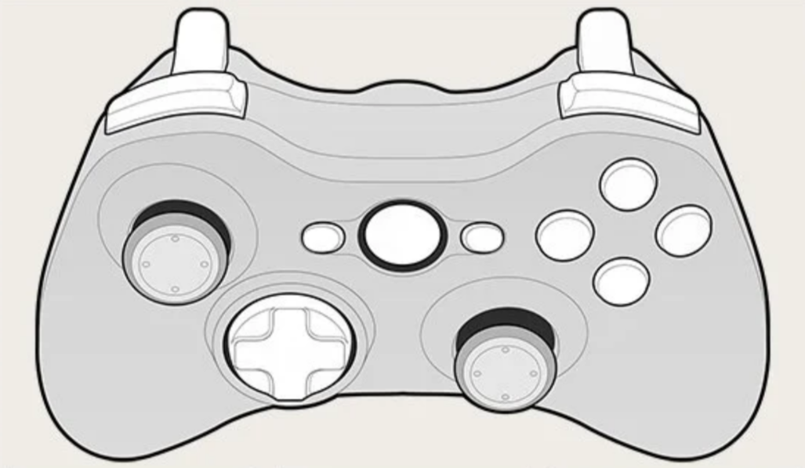

# Controller Support

Controller Support is done via SDL GameController interface. Under the hood SDL
uses joysticks, controllers are devices that can be mapped into a set of
buttons and axes.



## Managing Controllers

Controllers that are attached to the computer are identified by a `deviceId`.

Spring won't listen to events by controllers until they are connected, once
they are connected they are identified by an `instanceId`.

The `instanceId` from a connected controller is persisted even after it is
detached from the computer. If the controller is reattached, events will be
listened to again.

To clear the connection a controller must be disconnected.

A table representing the state of the current available controllers can be
fetched via:

```lua
{
  [deviceId] = { name = [name], instanceId = [instanceId] },
  ...
} = Spring.GetAvailableControllers()
```

Keep in mind the list above only returns controllers that are currently
attached.

To get a list of currently connected controllers (regardless if attached):

```lua
{ [instanceId1], [instanceId2], ... } = Spring.GetConnectedControllers()
```

### Managing connections

With a deviceId a connection can be performed via:
`(null|instanceId) = Spring.ConnectController(deviceId)`

With an instanceId a controller can be disconnected via:
`(true|false) = Spring.DisconnectController(instanceId)`

The following callins are available:

- `ControllerAdded(deviceIndex)`: When a controller is attached.
- `ControllerRemoved(instanceId)`: When a controller is detached.
- `ControllerConnected(instanceId)`: When a controller is connected.
- `ControllerDisconnected(instanceId)`: When a controller is disconnected.

## Managing input:

### Buttons

Buttons can only have a state of 0 or 1.

See [SDL_GameControllerButton](https://wiki.libsdl.org/SDL_GameControllerButton).

### Axes

Axes are components of the device that have some kind of continuous state, like
sticks and triggers.

> The state is a value ranging from -32768 to 32767. Triggers, however, range
> from 0 to 32767 (they never return a negative value).

See [SDL_GameControllerAxis](https://wiki.libsdl.org/SDL_GameControllerAxis).

### API

To get the current state of a controller use:

```lua
{
  axes: { [axisname] = axisvalue, ... },
  buttons: { [buttonname] = buttonstate, ... }
} = Spring.GetControllerState(instanceId)
```

Non existent axes or buttons for the controller are not indexed in the table
above.

Callins:

- `ControllerAxisMotion(int instanceId, int axisId, int value, string name)`
- `ControllerButtonUp(int instanceId, int buttonId, int state, string name)`
- `ControllerButtonDown(int instanceId, int buttonId, int state, string name)`

## Mappings

See: https://github.com/gabomdq/SDL_GameControllerDB

Acessing mapping properties:

- `GetControllerDeviceGUID(int deviceId)`
- `GetControllerGUID(int instanceId)`
- `GetControllerMappingForGUID(string guid)`

Set mappings:

- `AddControllerMapping(string mapping) -> true | false`
- `LoadControllerMappings(string mappings) -> loadedMappingsNum | nil`

Callin:

- `ControllerRemapped(int instanceId)`
